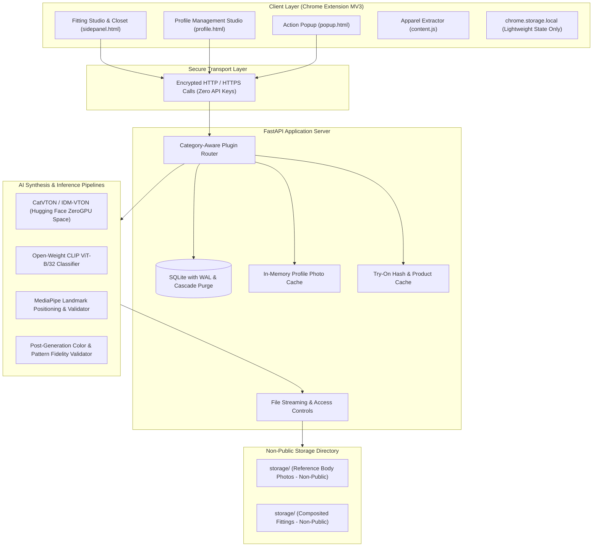

# AI Virtual Try-On: Architecture, Privacy & Security Hardening

## 1. Executive Summary

The **AI Virtual Try-On Studio** is an enterprise-grade virtual fitting application pairing a **Chrome Extension (Manifest V3)** with a high-performance **FastAPI backend**, an open-weight AI synthesis pipeline (**CatVTON on Hugging Face ZeroGPU**), zero-shot category classification (**CLIP**), keypoint positioning (**MediaPipe**), and automated post-generation fidelity verification (**Color/Pattern Accuracy Validator**).

This document outlines the architectural topology, security hardening, privacy safeguards, non-public asset storage, dual-tier caching, and Right-to-be-Forgotten compliance implemented across Phases 10 and 11.

---

## 2. System Topology & Architecture

---

## 3. Security Hardening Posture

### 3.1 Zero API Keys in Client Code
- **Client Surface**: The Chrome extension (`manifest.json`, `content.js`, `background.js`, `sidepanel.js`, `profile.js`) contains **zero** API tokens, secret keys, or service credentials.
- **Backend Isolation**: All model weights, inference tokens (`HF_TOKEN`), and private configurations reside exclusively in `backend/.env` loaded through `app.config.Settings`. The client only communicates with the authorized backend base URL (`BACKEND_BASE`).

### 3.2 Secure Transport & Protocol Integrity
- **Encrypted Transmission**: In production deployments, all extension-to-backend traffic is strictly enforced over **HTTPS/TLS 1.3**.
- **Cross-Origin Resource Sharing (CORS)**: FastAPI CORS middleware is restricted to explicit trusted browser origins (`chrome-extension://<id>`, `http://localhost:*`, `http://127.0.0.1:*`) rather than permissive wildcards.
- **Content Security Policy (CSP)**: Manifest V3 disallows `eval()` and inline remote scripts, preventing code injection or XSS vulnerabilities.

### 3.3 Non-Public Private Storage Architecture
- **No Static Directory Mounting**: Neither FastAPI nor any underlying web server mounts `storage/` as a public static directory (i.e. `app.mount("/static", ...)` is intentionally absent).
- **Gated Streaming Endpoints**:
  - `GET /api/photos/{photo_id}/file`
  - `GET /api/tryon/results/{result_id}/file`
  All files are securely read and streamed via FastAPI's `FileResponse` with `Cache-Control: private, max-age=86400`, preventing search engine indexation or unauthorized scraping.

---

## 4. Privacy Safeguards & Right-to-be-Forgotten

### 4.1 Explicit Model Training Opt-Out (`consent_no_training`)
- **No Model Training Guarantee**: When creating any digital fitting profile, users are presented with an explicit consent agreement:
  > *"I confirm my uploaded reference photos will only be used for personal virtual fitting synthesis and will never be used for AI model training or public display."*
- **Database Persistence**: The `profiles` table stores this opt-out flag as `consent_no_training INTEGER DEFAULT 1`.
- **Zero Third-Party Training**: Hugging Face ZeroGPU inference runs in ephemeral memory instances without persistence. No user photographs are ever retained, trained upon, or shared with external model developers.

### 4.2 Physical Disk Purge on `DELETE /api/profiles/{id}`
Unlike naive implementations where deleting a database row leaves orphaned images on disk, the backend enforces a physical purge routine:
1. **Query Associated Files**: Queries all physical file paths in `tryon_results` and `profile_photos` tied to `profile_id`.
2. **Physical Unlink**: Executes `Path.unlink()` on every composited fitting image and uploaded body photo on disk.
3. **Cascading Relational Delete**: SQLite `ON DELETE CASCADE` removes all associated metadata rows from `profiles`, `profile_photos`, and `tryon_results`.
4. **Cache Invalidation**: Evicts all memory and path cache entries tied to the profile ID.

---

## 5. Phase 10: Dual-Tier Caching & Wardrobe ("My Closet")

### 5.1 Dual-Tier Caching Architecture

| Cache Layer | Cache Key | Mechanism | Invalidation Trigger |
| :--- | :--- | :--- | :--- |
| **Backend Photo Cache** | `(profile_id, category, photo_type)` | In-memory path cache in `CatVTONService` | Profile photo upload, photo deletion, profile deletion |
| **Try-On Result Cache** | `(profile_id, product_id)` or `(profile_id, garment_image_url)` | Indexed SQLite lookup on `tryon_results` | Deleted profile, missing disk file, or `force_refresh=True` |

### 5.2 Cache Workflow
1. When a user requests a virtual try-on (`POST /api/tryon`), the backend checks if `force_refresh == False`.
2. If a result matching the `{profile_id, product_id}` exists and the image exists on disk, the cached result is returned **instantly** (`cached: true`), bypassing CLIP classification, MediaPipe drape alignment, and ZeroGPU diffusion.
3. If the user clicks **🔄 Re-try / Regenerate**, `force_refresh=True` is dispatched, bypassing the cache and generating a fresh fitting.

### 5.3 Extension Sidepanel "My Closet" (Wardrobe View)
- **Live Closet Grid**: Located directly beneath the Results View in `sidepanel.html`.
- **Fittings History**: Fetches `GET /api/tryon/profile/{profile_id}`.
- **Card Metadata**: Displays a high-resolution preview thumbnail, garment title, category, date, and accuracy fidelity badge (e.g., `96%` or `⚠️ Low`).
- **Interactive Preview**: Clicking any fitting card immediately renders it in the primary Results View for inspection or downloading.

---

## 6. Verification & Automated Test Coverage

The privacy, security, caching, and purging behaviors are verified via automated regression test suites located in `backend/tests/`:

- `test_phase10_11.py`:
  - `test_phase10_11_suite`:
    1. Creates profile with `consent_no_training=True`.
    2. Uploads reference photo and confirms private streaming route.
    3. Runs initial try-on and confirms cache miss (`cached=False`).
    4. Re-runs try-on for same profile + product and confirms instant cache hit (`cached=True`).
    5. Dispatches `force_refresh=True` and confirms fresh generation (`cached=False`).
    6. Verifies closet history endpoint returns fittings with product titles.
    7. Executes `DELETE /api/profiles/{id}` and verifies database 404s and physical file unlinking from disk.
- `test_phase1.py` through `test_phase9.py`:
  - Profile isolation, MediaPipe landmark gating, product scraping, ZeroGPU orchestration, router plugins, and color/pattern accuracy safeguards.

---

## 7. Compliance & Regulatory Alignment

- **GDPR Article 17 (Right to Erasure)**: Fully compliant via `DELETE /api/profiles/{id}` physical file unlinking.
- **Data Minimization**: Extension transmits only minimal necessary identifiers (`profile_id`, `product_id`); raw photos are never re-uploaded on repeat requests.
- **Explicit Consent**: Profile creation mandates clear user opt-out regarding model training and public exposure.
