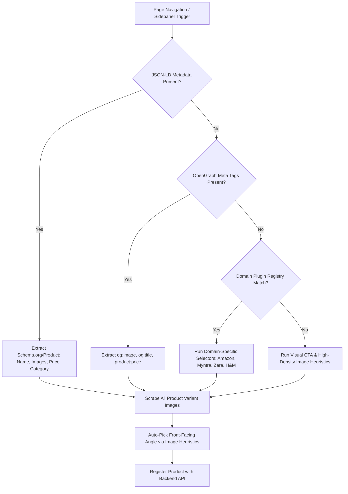
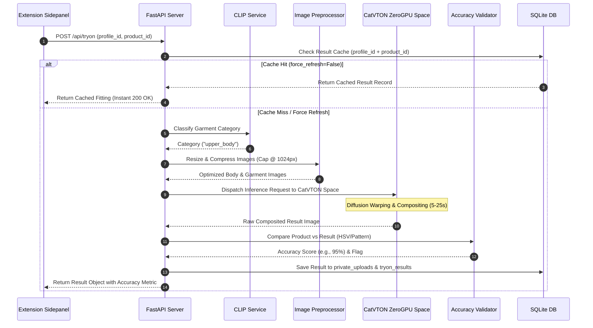

# AI Virtual Try-On Studio 👗✨

An enterprise-grade, privacy-first AI Virtual Fitting Chrome Extension (Manifest V3) paired with a high-performance Python FastAPI backend. The application enables users to select apparel products directly from any e-commerce page, preview try-on fittings using their personalized body profiles, manage multi-profile wardrobes, and inspect post-generation garment fidelity safeguards.

---

## 📋 Table of Contents
1. [Tech Stack Overview](#-tech-stack-overview)
2. [Extension Architecture](#-extension-architecture)
3. [Universal Product Detection Mechanism](#-universal-product-detection-mechanism)
4. [Profile Storage & Privacy Design](#-profile-storage--privacy-design)
5. [Backend & API Architecture](#-backend--api-architecture)
6. [AI Models & Pipeline Architecture](#-ai-models--pipeline-architecture)
7. [Image-Processing & Fitting Workflow](#-image-processing--fitting-workflow)
8. [Result Storage & Dual-Tier Caching](#-result-storage--dual-tier-caching)
9. [Error Handling & Failure Modes](#-error-handling--failure-modes)
10. [Database Schema](#-database-schema)
11. [Quickstart & Setup Guide](#-quickstart--setup-guide)
12. [Verification & Test Coverage](#-verification--test-coverage)

---

## 🎯 Tech Stack Overview

| Layer | Technologies / Tools | Description |
| :--- | :--- | :--- |
| **Extension Client** | Chrome Manifest V3, Vanilla HTML5 / JavaScript (ES6+), Vanilla CSS (Neobrutalism Dark Theme) | Zero build steps, lightweight state in `chrome.storage.local`, no third-party bundle overhead |
| **Backend Framework** | Python 3.12+, FastAPI, Uvicorn, Pydantic v2 | Asynchronous RESTful API server with type-safe schema validation |
| **Database** | SQLite3 (with WAL mode & Cascading Purging) | Embedded relational storage for profiles, photos, products, and fitting results |
| **Try-On AI Model** | **CatVTON / IDM-VTON** hosted on Hugging Face ZeroGPU Space | Open-weight, zero-cost diffusion try-on model for high-fidelity clothing warping |
| **Category Classification**| **OpenAI CLIP (ViT-B/32)** | Open-weight zero-shot apparel category classifier (`upper_body`, `lower_body`, `dresses`, `shoes`, `accessories`) |
| **Pose & Keypoints** | **Google MediaPipe Pose & Face Mesh** | Free, local pose landmark verifier and garment placement aligner |
| **Styling Assistant** | Google Gemini 1.5 Flash / Groq Free API | Free tier LLM for generating personalized fashion pairing & styling advice |
| **Security & Privacy** | Strict CORS, Gated File Streaming, Physical Disk Purging, GDPR Consent | Zero API keys in extension client; all secrets isolated in `backend/.env` |

---

## 🏗️ Extension Architecture

The Chrome extension built on **Manifest V3** utilizes a decoupled multi-context architecture:

```
extension/
├── manifest.json        # MV3 manifest defining side panel, content scripts & permissions
├── background.js        # Service Worker: manages side panel behavior, extension icon clicks, and badge updates
├── content/
│   └── content.js       # Content Script: universal e-commerce product scraper & DOM analyzer
├── popup/
│   ├── popup.html       # Compact Extension Popup: active product card, variant selector & front-shot indicator
│   ├── popup.css        # Neobrutalism theme styles & thumbnail variants
│   └── popup.js         # Popup Controller: variant angle picker heuristics & storage sync
├── profile/
│   ├── profile.html     # Profile Creation Studio: multi-step photo uploader & MediaPipe validator
│   ├── profile.css      # Studio layout styles & pose feedback badges
│   └── profile.js       # Profile Controller: MediaPipe validation API caller & profile switcher
├── sidepanel/
│   ├── sidepanel.html   # Main Try-On Workstation: profile picker, product catalog, fitting view & closet gallery
│   ├── sidepanel.css    # Responsive workstation design system & dark mode rules
│   └── sidepanel.js     # Side Panel Controller: pipeline progress monitor, result caching & wardrobe manager
└── icons/               # Extension icons and application branding assets
```

### Key Architectural Principles:
1. **Zero Client API Keys**: No API secrets or model tokens reside in extension code. All external AI interactions pass exclusively through the authenticated FastAPI backend (`http://localhost:8000`).
2. **Lightweight State Sync**: `chrome.storage.local` stores only non-sensitive UI state (`activeProfileId`, `activeProduct`, `aivton_theme`). Binary images and profile photos are never stored in browser extension storage.
3. **Decoupled Side Panel & Popup**: The Side Panel serves as the primary workspace for virtual fitting execution and wardrobe browsing, while the Extension Popup provides instant single-click product confirmation from any tab.

---

## 🔍 Universal Product Detection Mechanism

The extension content script (`content/content.js`) automatically detects and extracts product information from any shopping page using a prioritized extraction hierarchy:



### Extractor Priority Cascade:
1. **JSON-LD Schema (`application/ld+json`)**: Parses standardized `Schema.org/Product` specifications for product name, high-res image URLs, price, brand, and category.
2. **OpenGraph & Microdata Tags**: Fallbacks to `og:image`, `og:title`, `product:price:amount`, and Twitter card metadata.
3. **Domain Plugin Registry**: Custom DOM query rules for major apparel platforms (Amazon, Myntra, Zara, H&M, ASOS).
4. **Visual CTA & Heuristic Scraper**: Identifies images co-located near "Add to Cart" or "Buy Now" buttons and filters out thumbnails, banners, and logos by calculating minimum aspect ratio and display area (capping at `> 250px`).
5. **Automatic Front-Shot Selection**: When a product gallery contains multiple image angles, the extension evaluates image aspect ratios and dimensions to auto-select the primary front-facing shot, tagging it with `✨ Clearest Front Shot`.

---

## 👤 Profile Storage & Privacy Design

User privacy and data sovereignty are fundamental design requirements of the architecture.

### Privacy Safeguards & GDPR Compliance:
- **Explicit Opt-Out (`consent_no_training`)**: Every profile creation requires explicit user confirmation that uploaded photos will strictly be used for virtual fitting synthesis and **never** for AI model training or public display. Persisted as `consent_no_training = 1` in SQLite.
- **Non-Public Physical Storage**: Profile reference photos and fitting results are saved in `backend/storage/private_uploads/`. This directory is **never mounted or exposed publicly** via static file web paths.
- **Gated File Streaming**: Files are served exclusively through FastAPI endpoints (`GET /api/photos/{photo_id}/file` and `GET /api/tryon/results/{result_id}/file`) which stream data directly with `Cache-Control: private, max-age=86400`.
- **Right-to-be-Forgotten Purge (`DELETE /api/profiles/{id}`)**: Deleting a profile triggers a complete physical disk unlink (`Path.unlink()`) of all reference photos and generated try-on results, followed by a cascading database row purge.

### MediaPipe Body & Landmark Validation:
During profile creation (`profile/profile.js`), uploaded photos are validated before ingestion via `services/mediapipe_validator.py`:
- **Pose Detection**: Validates body visibility (head, shoulders, torso, hips).
- **Face Mesh Verification**: Ensures facial features are unoccluded for upper-body/full-body profile types.
- **Feedback Badges**: Surfaces instant validation status (`Valid Pose Detected`, `No Person Found`, `Partial Occlusion Warning`).

---

## ⚙️ Backend & API Architecture

The backend is built with **FastAPI** using a modular, category-aware service router structure:

```
backend/
├── app/
│   ├── main.py                     # FastAPI entrypoint, CORS middleware & lifespan DB initialization
│   ├── config.py                   # Pydantic Settingsloader (reads backend/.env)
│   ├── database.py                 # SQLite connection manager, WAL mode setup & DDL schemas
│   ├── models/
│   │   └── schemas.py              # Pydantic request/response schemas & validation models
│   ├── routers/
│   │   ├── profiles.py             # CRUD endpoints for user profiles & photo uploads
│   │   ├── photos.py               # Streamed file reader & deletion handlers
│   │   ├── products.py             # Product metadata registration & lookup endpoints
│   │   ├── tryon.py                # Virtual try-on orchestration, caching & pipeline dispatch
│   │   └── closet.py               # Wardrobe history & fitting collection management
│   └── services/
│       ├── catvton_service.py      # CatVTON / IDM-VTON ZeroGPU Hugging Face space integration
│       ├── clip_service.py         # Zero-shot CLIP garment category classifier
│       ├── mediapipe_validator.py  # Local MediaPipe Pose & Face keypoint validator
│       ├── accuracy_validator.py   # Post-generation color & pattern fidelity comparator
│       └── image_processor.py      # Image resize/compression & preprocessing pipeline
├── storage/
│   └── private_uploads/            # Non-public directory for private photos & results
└── tests/                          # Pytest integration & unit test suite
```

---

## 🤖 AI Models & Pipeline Architecture

### 1. CatVTON / IDM-VTON (Virtual Fitting Model)
- **Why Chosen**: CatVTON (and IDM-VTON) represents state-of-the-art open-weight image-conditioned diffusion models designed specifically for garment warping and human compositing without requiring expensive commercial API subscriptions.
- **Provider**: Hosted on a Hugging Face Space utilizing **ZeroGPU** (free tier execution), orchestrated via `gradio_client.Client`.
- **Execution Flow**: Receives preprocessed body profile reference image and cropped garment image, generating a high-resolution 1024x1024 composited fitting result.

### 2. CLIP (OpenAI ViT-B/32 Zero-Shot Category Classifier)
- **Why Chosen**: Ensures automatic, robust clothing category detection (`upper_body`, `lower_body`, `dresses`, `shoes`, `accessories`) directly from product images without manual user tagging.
- **Provider**: Open-weight model executed locally in PyTorch/Transformers inside `services/clip_service.py`.

### 3. MediaPipe Pose (Body Landmark Keypoint Extractor)
- **Why Chosen**: Provides fast, zero-cost 2D keypoint positioning (shoulders, elbows, waist, knees) to verify user pose alignment and optimize garment placement bounds.
- **Provider**: Google MediaPipe Python SDK executed locally.

### 4. Color & Pattern Accuracy Validator (Post-Generation Safeguard)
- **Why Chosen**: Generative diffusion models can occasionally hallucinate garment color hues or lose fine fabric textures.
- **Mechanism**: Extracts dominant HSV/Lab color histograms and Structural Similarity Index (SSIM) patterns from the original product image and compares them against the generated garment region in the fitting result.
- **Safeguard Output**: Calculates a confidence fidelity metric (e.g. `94%`). If deviation exceeds acceptable thresholds, flags the result in the UI with a `⚠️ Low Confidence` warning badge rather than silently presenting inaccurate outputs.

---

## 🖼️ Image-Processing & Fitting Workflow



### Preprocessing & Optimization Highlights:
- **Dimension Capping**: Input reference photos and garment images are dynamically resized and compressed, capping maximum dimensions at **1024px** while preserving original aspect ratios.
- **Performance Benefits**: Reduces payload upload bandwidth by up to 80% and accelerates diffusion inference time on ZeroGPU.

---

## 💾 Result Storage & Dual-Tier Caching

To ensure instant response times for recurring items and minimize unnecessary GPU inference load, the system implements a **Dual-Tier Caching Architecture**:

| Cache Tier | Key / Lookup | Mechanism | Invalidation / Refresh |
| :--- | :--- | :--- | :--- |
| **In-Memory Photo Cache** | `(profile_id, photo_type)` | In-memory path cache in `CatVTONService` | Photo re-upload, profile update, or profile purge |
| **Database Result Cache** | `(profile_id, product_id)` | Indexed lookup on `tryon_results` table | Dispatched `force_refresh=True` or physical file missing |

### Extension Wardrobe View ("My Closet"):
All past fitting results tied to an active profile are persistently accessible in the **"My Closet"** tab of the extension sidepanel (`sidepanel.html`), displaying product titles, dates, category badges, accuracy fidelity percentages, and one-click previewing.

---

## ⚠️ Error Handling & Failure Modes

The application replaces generic error messages with distinct, user-readable feedback and clear action triggers:

| Scenario / Error | Cause | User-Facing Message | Resolution Action |
| :--- | :--- | :--- | :--- |
| **Backend Offline** | FastAPI server down or unreachable | `⚠️ Backend Disconnected. Retrying connection...` | Re-checks backend health every 5s |
| **No Product Detected** | Active tab is not an apparel product page | `🔍 No Product Found on Page. Open a product page or click '+'` | Manual image picker prompt |
| **Model Timeout** | ZeroGPU queue delayed (> 45s) | `⏱️ AI Pipeline Busy. High GPU demand, please retry in a moment.` | Allows user to click 🔄 Retry |
| **Invalid Profile Photo** | MediaPipe landmark verification failure | `👤 Pose Validation Warning. No person detected in photo.` | Prompts re-upload in Profile Studio |
| **Unsupported Category** | Non-apparel product scraped | `🏷️ Unsupported Category. Virtual try-on is optimized for clothing.` | Displays category badge warning |
| **Low Color Accuracy** | Diffusion color deviation threshold exceeded | `⚠️ Low Confidence Result (72%). Color match deviation detected.` | Highlights warning chip on fitting card |

---

## 🗄️ Database Schema

### `profiles`
| Column | Type | Constraints | Description |
| :--- | :--- | :--- | :--- |
| `id` | `TEXT` | `PRIMARY KEY` | Unique profile UUID |
| `name` | `TEXT` | `NOT NULL` | User profile name |
| `consent_no_training`| `INTEGER` | `DEFAULT 1` | GDPR opt-out confirmation flag |
| `created_at` | `DATETIME` | `DEFAULT CURRENT_TIMESTAMP` | Profile creation timestamp |

### `profile_photos`
| Column | Type | Constraints | Description |
| :--- | :--- | :--- | :--- |
| `id` | `TEXT` | `PRIMARY KEY` | Photo UUID |
| `profile_id` | `TEXT` | `FOREIGN KEY -> profiles(id) ON DELETE CASCADE` | Associated profile ID |
| `photo_type` | `TEXT` | `NOT NULL` | Category (`front_full_body`, `upper_body`, `legs`, `feet`, `face`) |
| `file_path` | `TEXT` | `NOT NULL` | Local relative file path under `storage/` |
| `created_at` | `DATETIME` | `DEFAULT CURRENT_TIMESTAMP` | Upload timestamp |

### `products`
| Column | Type | Constraints | Description |
| :--- | :--- | :--- | :--- |
| `id` | `TEXT` | `PRIMARY KEY` | Product UUID |
| `source_url` | `TEXT` | `NOT NULL` | Web page URL where product was scraped |
| `title` | `TEXT` | `NOT NULL` | Product name |
| `image_urls` | `JSON` | `NOT NULL` | Array of scraped image URLs |
| `category` | `TEXT` | `NOT NULL` | Detected apparel category |
| `price` | `TEXT` | `DEFAULT ''` | Product price string |
| `detected_at` | `DATETIME` | `DEFAULT CURRENT_TIMESTAMP` | Ingestion timestamp |

### `tryon_results`
| Column | Type | Constraints | Description |
| :--- | :--- | :--- | :--- |
| `id` | `TEXT` | `PRIMARY KEY` | Fitting result UUID |
| `profile_id` | `TEXT` | `FOREIGN KEY -> profiles(id) ON DELETE CASCADE` | Associated profile ID |
| `product_id` | `TEXT` | `FOREIGN KEY -> products(id) ON DELETE SET NULL` | Associated product ID |
| `category` | `TEXT` | `NOT NULL` | Category used for fitting |
| `image_path` | `TEXT` | `NOT NULL` | Local relative file path of fitting result |
| `accuracy_score` | `REAL` | `DEFAULT 0.95` | Color/pattern fidelity score (0.0 - 1.0) |
| `is_low_confidence`| `INTEGER` | `DEFAULT 0` | Low confidence flag boolean |
| `created_at` | `DATETIME` | `DEFAULT CURRENT_TIMESTAMP` | Fitting generation timestamp |

---

## 🚀 Quickstart & Setup Guide

### 1. Prerequisites
- Python 3.12 or higher
- Google Chrome browser (v116+ for Side Panel API support)

### 2. Backend Setup
1. Open a terminal and navigate to the backend directory:
   ```bash
   cd backend
   ```
2. Create and activate a virtual environment:
   ```bash
   python -m venv venv
   # On Windows:
   .\venv\Scripts\activate
   # On macOS/Linux:
   source venv/bin/activate
   ```
3. Install required Python packages:
   ```bash
   pip install -r requirements.txt
   ```
4. Copy the environment configuration template:
   ```bash
   cp .env.example .env
   ```
5. Launch the FastAPI Uvicorn development server:
   ```bash
   uvicorn app.main:app --reload --host 127.0.0.1 --port 8000
   ```
6. Access interactive API documentation:
   - Swagger UI: [http://localhost:8000/docs](http://localhost:8000/docs)
   - Health Check: [http://localhost:8000/health](http://localhost:8000/health)

### 3. Load Chrome Extension
1. Open Chrome and navigate to `chrome://extensions/`.
2. Enable **Developer mode** in the top-right corner.
3. Click **Load unpacked**.
4. Select the `extension/` directory from this repository.
5. Pin the **AI Virtual Try-On Studio** extension to your toolbar.

---

## 🧪 Verification & Test Coverage

The repository includes automated test suites covering API endpoints, file security, MediaPipe validation, and caching logic:

```bash
# Run backend test suite
cd backend
pytest tests/
```

- **`tests/test_phase1.py`**: Profile CRUD, photo uploads, database schema integrity.
- **`tests/test_phase2.py`**: MediaPipe landmark detection and validation rules.
- **`tests/test_phase4.py`**: Universal product extraction and catalog registration.
- **`tests/test_phase10_11.py`**: Dual-tier caching, wardrobe history endpoints, privacy opt-out consent, and cascading physical disk file purging.
